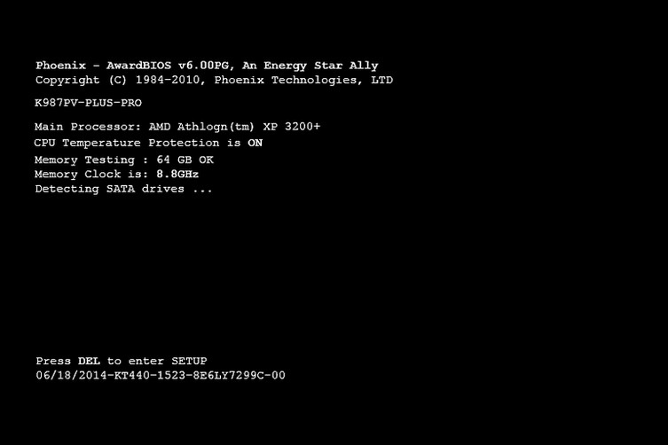
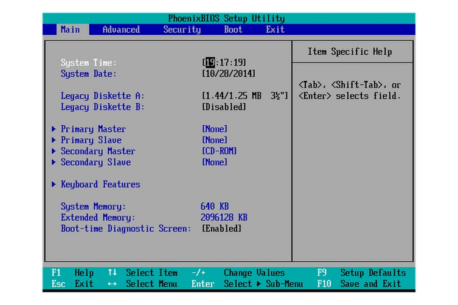
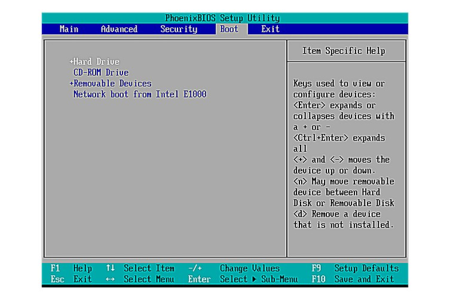
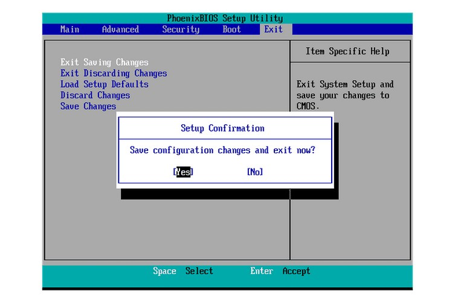

+++
title = "Recuperación de Datos de PCs Antiguos"
description = "Guía paso a paso para recuperar datos de computadoras viejas usando Linux USB y configuración de BIOS"
date = "2025-01-30"
tags = ["tutorial", "recuperacion-datos", "bios", "linux", "troubleshooting"]
categories = ["tutoriales"]
authors = ["adrián"]
+++

# Recuperación de Datos de PCs Antiguos

No necesitas la USB para la primera parte que es configurar la BIOS. La BIOS suele ser similar a la de las imágenes, en
el mejor de los escenarios, también será tu caso.

> Si logras entrar a la BIOS, al menos puedes estar seguro de que la lap o PC están funcionales.

---

## Preparación

Teclado y mouse hacen todo más fácil.

Ten a la mano la USB de Linux, así como la USB para extraer los datos, si esta última no tiene mucha memoria, sería
estar vaciando lo que vayas rescatando a la otra lap varias veces.

### Consideraciones

Te recomiendo que tengas la otra lap a la mano por si necesitas ver algún vídeo o este intento de guía.

No te recomiendo extraer **ningún .exe, .scr, o .lib de la lap**. Si alguno de estos archivos está infectado, podrías
estar copiando el **malware** a cualquier PC. *Si ya los copiaste no pasa nada, solo ten cuidado, el problema llega al
darles click por accidente y estos se ejecuten.*

**Solo copia documentos, imágenes, música, código o videos.** Además, **no puedes salvar** programas(`MatLab.exe`,
`LabView.exe`, etc.) como tal, lo que sí se puede rescatar son archivos o scripts(`.mat`, `.py`, etc.).

---

## Configurar la prioridad de arranque en la BIOS

La BIOS es donde puedes cambiar la configuración del orden de arranque.

### 1. Enciende la lap y espera por el mensaje de configuración de la BIOS

La pantalla de carga es donde sale la marca "Dell", "Gateway" u otra marca, casi siempre ahí indica que tecla te lleva a
la BIOS.



Ahora, en mi experiencia, siempre me ha tocado que sea *F11 o F8* para entrar a la BIOS.
**Inmediatamente** comienza a pulsar la tecla para entrar en la BIOS (*en algunos otros casos puede ser F2, F7, Del*).

> Presiónala varias veces, puedes probar varias a la vez.

### 2. Accede a la utilidad de configuración de la BIOS

Si tu BIOS es confusa, busca un video en YouTube con el modelo de tu lap y "BIOS"



Si salió bien lo de la tecla de la BIOS, accederás a la utilidad de configuración de la BIOS. **Los cambios en el orden
de arranque son realizados en el menú Boot.**

### 3. Localizar las opciones de orden de arranque en la BIOS

¡Recuerda, tu BIOS puede presentar instrucciones diferentes!



Para seleccionar qué dispositivo arrancará primero, sigue las instrucciones en la pantalla de la utilidad de setup la
BIOS para cambiar el orden de arranque.

En este ejemplo de BIOS, el orden de arranque puede ser modificado utilizando las teclas + y -. A veces es con Arriba /
Abajo.

### 4. Haz cambios en el orden de arranque

La idea es llevar CD/USB como 1ra opción y Disco duro como 2da opción.


La BIOS ahora buscará primero la USB booteable conectada en algún puerto, antes de intentar arrancar desde el disco
duro.

### 5. Guardar los cambios


Sigue las instrucciones de la BIOS para navegar hacia el menú de **"Exit" o "Save and Exit"**.

### 6. Confirma los cambios

Asegúrate de confirmar los cambios antes de reiniciar. Si piensas seguir con la extracción de datos, ya puedes conectar
ambas USBs.



Lee el mensaje cuidadosamente para asegurarte que te encuentras efectivamente guardando tus cambios y no saliendo sin
guardarlos.

### 7. Inicia la lap con el nuevo orden de arranque


---

## Recuperar tus datos

Algo así verás al iniciar el Linux. No hagas lo de la instalación o puedes perder tus datos, con que llegues al
escritorio esta bien. [Video del 3:25 al 3:40](https://youtu.be/phZt9YA3ny8?si=6DWvteb1QmAIlwvF&t=206)

### Transferir archivos

Si abres la unidad de almacenamiento incorrecta, simplemente cierra con X en la esquina superior derecha de la ventana

1. En la **parte inferior izquierda** de tu escritorio hay una lista de todos los discos duros/particiones y unidades
   USB con un *icono de disco duro.*
2. Abre tu antiguo disco duro (*probablemente `sda1`*)
3. Luego, abre tu otra USB (*probablemente `sdc` o `sdb1`*)
4. Desde tu antiguo disco duro, arrastra y suelta los archivos/carpetas que desees transferir a la ventana de tu unidad
   USB.
5. Una vez que arrastres y sueltes tu primera carpeta, aparecerá un pequeño menú con opciones para mover o copiar. Elige
   **COPIAR** cada vez que arrastres y sueltes.

> Si algún error te llega a salir, solo tómale foto, y ya lo vemos después.

**La ruta común a tus carpetas de imágenes, música, vídeo y documentos es:**

```
Documents and Settings >> All Users >> Documents >> 
Ahora verás My Music, My Pictures y My Videos.
```

### ¿Todo listo?

Para apagar la lap, simplemente haz clic en *Menu >> Pasa el ratón sobre Shutdown >> Reboot/Turn Off Computer*.

Después de extraer los datos, asegúrate de conectar tu unidad USB a otra computadora Windows funcionando para verificar
que todos los datos están ahí y se transfirieron sin corrupción.

### Insisto

**NO copies archivos ejecutables (`.exe`, `.scr`, etc.).**

---

*Esta guía ha ayudado a muchas personas a recuperar recuerdos preciosos y documentos importantes.*
